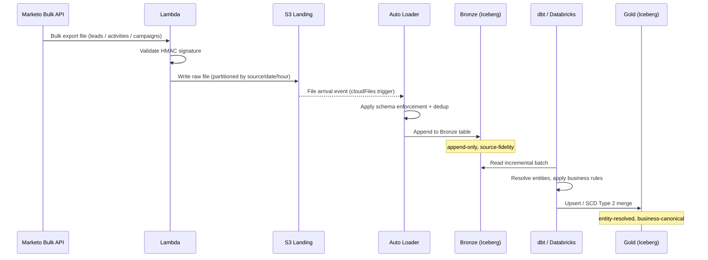
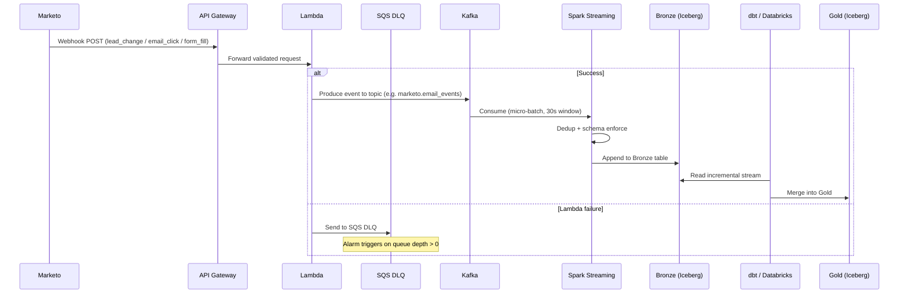
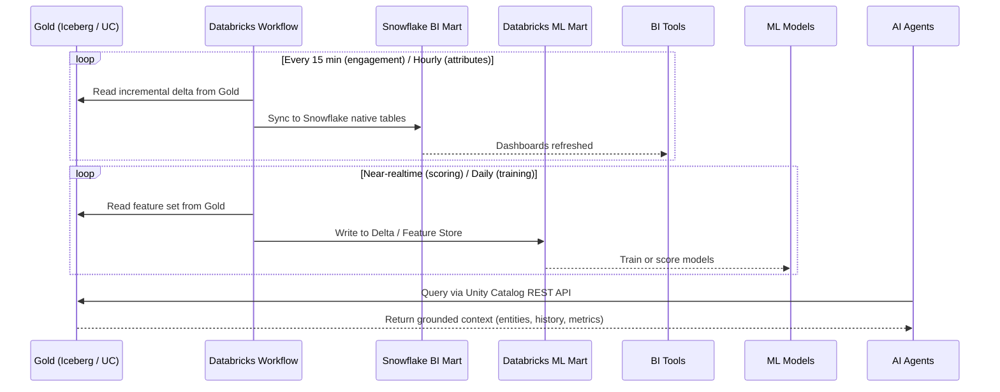
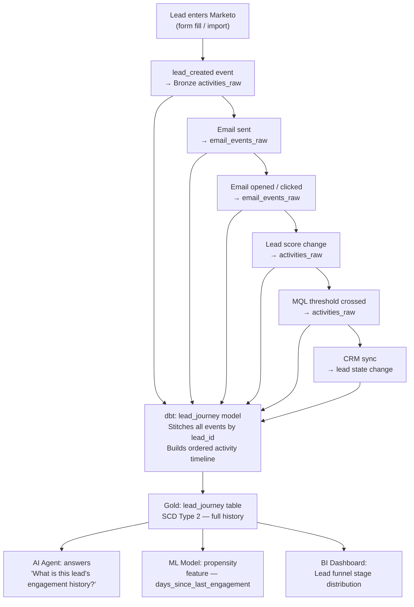
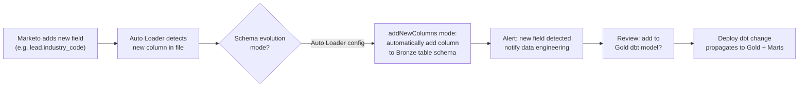

# Marketo Data Streams — Data Flow Sequences

## 1. Batch / Historical Ingestion Path

---

## 2. Near-Realtime Webhook Path

---

## 3. Mart Refresh and Serving Path

---

## 4. Lead Journey Reconstruction

---

## 5. Schema Evolution Handling

