# Marketo Data Streams (MDS)

Real-time and batch ingestion pipeline for Marketo marketing data, built on Apache Iceberg with Unity Catalog as the shared curated core. Native marts are served per engine (Snowflake for BI, Databricks for ML), with the Gold layer acting as the central grounding layer for AI agents.

---

## Architecture

```mermaid
flowchart LR

  subgraph SRC["Marketo Sources"]
    direction TB
    HIST["Historical + Batch\n(files)"]
    WH["Webhooks\n(near-realtime)"]
  end

  subgraph ING["Ingestion Layer"]
    direction TB
    APIGW["API Gateway\nLambda  +  SQS DLQ"]
    S3L["S3 Landing"]
    KAFKA["Kafka\n(near-realtime path)"]
  end

  subgraph PROC["Processing Layer"]
    direction TB
    AL["Auto Loader\n(batch / micro-batch)"]
    SSS["Spark Structured\nStreaming"]
  end

  subgraph UC["Unity Catalog — Governance · Lineage · Access · REST API"]
    subgraph CORE["Shared Core — Apache Iceberg  (single source of truth)"]
      RAW["RAW  /  Bronze\nSource-fidelity · append-only"]
      CURATED["CURATED  /  Gold\nEntity-resolved · business-canonical\n★  Agent Grounding Layer"]
    end
  end

  subgraph MARTS["Native Marts  (per engine)"]
    direction TB
    SF["Snowflake\nBI-Mart  (native tables)\nHigh-frequency delta"]
    DB["Databricks\nML Marts  (native detail)\nML-fresh data"]
  end

  subgraph CONSUME["Consumers"]
    direction TB
    BI["BI Tools\nMetabase · Tableau · Domo"]
    ML["ML Tooling\nNotebooks · Models"]
    AI["AI Agents"]
  end

  HIST -->|drop| APIGW
  WH -->|drop| APIGW
  APIGW -->|lands| S3L
  APIGW -->|produces| KAFKA
  S3L -->|auto-loads| AL
  KAFKA -->|consumes| SSS
  AL -->|appends| RAW
  SSS -->|appends| RAW
  RAW -->|dbt transforms| CURATED
  CURATED -->|materializes BI-ready data| SF
  CURATED -->|materializes ML-rich data| DB
  SF -->|dashboards| BI
  DB -->|train / score| ML
  CURATED -->|query / ground| AI
```



---

## Design Principles

| Principle | How it's applied |
|-----------|-----------------|
| **Single source of truth** | All Marketo data lands in one shared Iceberg core in Unity Catalog — no engine-specific raw copies |
| **Source fidelity in Bronze** | RAW layer is append-only, never mutated — full audit trail preserved |
| **Engine-native marts** | Snowflake and Databricks each materialise from Gold into their native formats; transformation logic lives once |
| **Central agent grounding** | The Gold (Curated) layer is the authoritative context store for all AI agents — no agent reads from raw |
| **Dual ingestion paths** | Batch files via S3 → Auto Loader; near-realtime events via Webhooks → Kafka → Spark Streaming |
| **Governance by default** | Unity Catalog enforces lineage, access controls, and data contracts across all consumers |

---

## Repository Structure

```
marketo-data-streams/
├── README.md               # This file — overview and architecture diagram
├── ARCHITECTURE.md         # Layer-by-layer design decisions and component specs
├── FLOW.md                 # Sequence flows: batch path, streaming path, mart refresh
└── diagrams/
    └── marketo_udl.py      # Python script — generates PNG architecture diagram
```

---

## Quick Links

- [Architecture](ARCHITECTURE.md) — component breakdown, tech choices, failure modes
- [Data Flow](FLOW.md) — sequence diagrams for batch, streaming, and serving paths
- [Diagram generator](diagrams/marketo_udl.py) — run locally to produce a PNG
